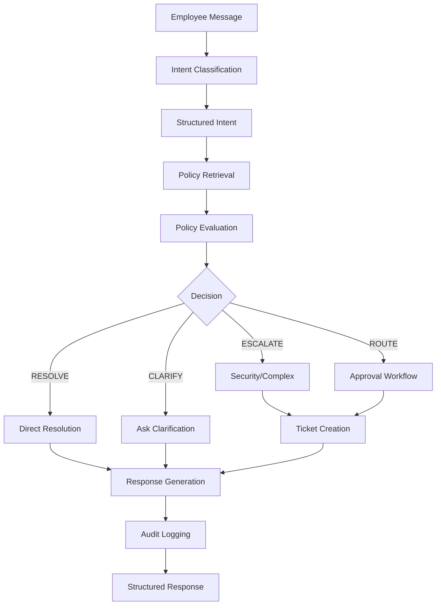
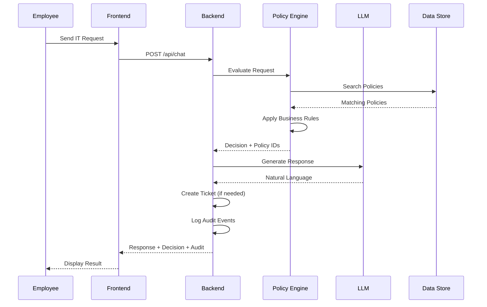
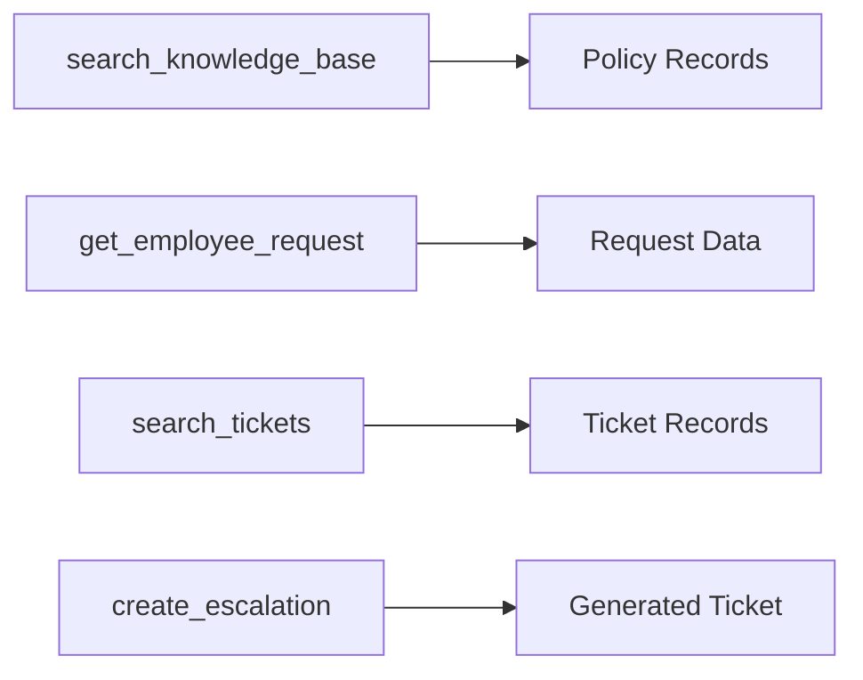
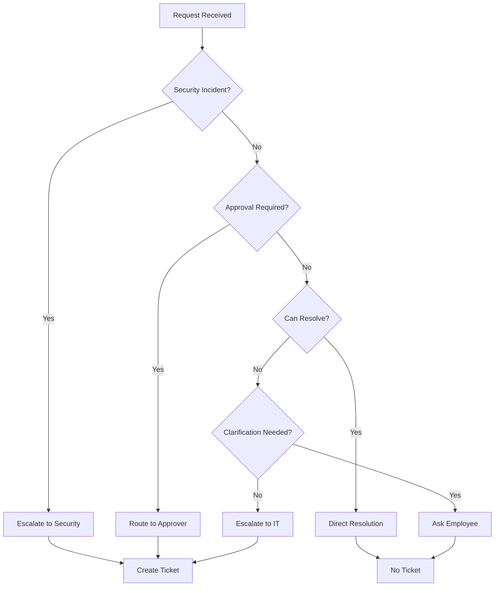

# Architecture Documentation

## System Architecture

```
┌─────────────────────────────────────────────────────────────┐
│                        Frontend (React)                      │
│  ┌──────────────┐  ┌──────────────┐  ┌──────────────┐      │
│  │   Chat UI    │  │ Decision     │  │  Ticket      │      │
│  │              │  │  Display     │  │  Display     │      │
│  └──────────────┘  └──────────────┘  └──────────────┘      │
└──────────────────────────┬──────────────────────────────────┘
                           │ HTTP/REST
                           ▼
┌─────────────────────────────────────────────────────────────┐
│                      Backend (FastAPI)                      │
│  ┌──────────────┐  ┌──────────────┐  ┌──────────────┐      │
│  │   Agent      │  │   Policy     │  │   Ticket     │      │
│  │ Orchestrator │  │   Engine     │  │   Manager    │      │
│  └──────────────┘  └──────────────┘  └──────────────┘      │
│  ┌──────────────┐  ┌──────────────┐  ┌──────────────┐      │
│  │  Retrieval   │  │    Audit     │  │    Models    │      │
│  │   System     │  │    Logger    │  │  (Pydantic)  │      │
│  └──────────────┘  └──────────────┘  └──────────────┘      │
└──────────────────────────┬──────────────────────────────────┘
                           │
         ┌─────────────────┼─────────────────┐
         ▼                 ▼                 ▼
┌──────────────┐  ┌──────────────┐  ┌──────────────┐
│   Groq LLM   │  │  policies.   │  │   tickets.   │
│  (Intent &   │  │    json      │  │    json      │
│  Response)   │  │              │  │              │
└──────────────┘  └──────────────┘  └──────────────┘
```

## Agent Workflow



## Data Flow



## Tool Flow



### Tool Implementations

**1. search_knowledge_base()**
- Input: query/intent/keywords
- Output: matching policy records
- Method: Deterministic keyword/category matching
- No vector database (policy corpus is small)

**2. get_employee_request()**
- Input: request ID, employee name, or query
- Output: employee request record
- Method: ID or name matching

**3. search_tickets()**
- Input: issue/category/employee
- Output: matching active and historical tickets
- Method: Text matching with active filter

**4. create_escalation()**
- Input: employee, issue, reason, policy source, destination
- Output: generated ticket ID, status, audit event
- Method: Auto-increment ID generation

## Escalation Flow



## Decision Tree

```
Message
├── Security Incident (phishing, malware, unauthorized)
│   └── ESCALATE → Security (KB-09)
├── Guest Wi-Fi
│   └── RESOLVE → Front-desk kiosk (KB-07)
├── Password Issue
│   ├── ≥5 failed attempts → ESCALATE → IT (KB-01)
│   └── <5 attempts → RESOLVE → Self-service (KB-01)
├── VPN Issue
│   ├── Contractor → ROUTE → Manager approval (KB-02)
│   ├── Expired credentials → RESOLVE → Renew (KB-02)
│   └── General → RESOLVE → Automatic for FTE (KB-02)
├── Laptop Issue
│   ├── ≥3 years + failure → ROUTE → IT + Finance (KB-03, ASSET-01)
│   ├── <3 years + failure → ROUTE → IT diagnostic (KB-03, ASSET-01)
│   └── Age/failure unknown → CLARIFY
├── Software Installation
│   ├── Non-catalog → ESCALATE → IT Security (KB-04)
│   ├── Catalog → RESOLVE → Self-install (KB-04)
│   └── Unknown → CLARIFY
├── Printer Issue
│   └── ROUTE → IT (after queue/spooler check) (KB-05)
├── Mailbox Quota
│   └── RESOLVE → Archive or request increase (KB-06)
├── Expense Software
│   ├── Login issue → ROUTE → IT (KB-08)
│   └── Access request → ROUTE → Finance (KB-08)
├── Home Office Equipment
│   ├── >3 days/week → ROUTE → Finance (KB-10)
│   └── ≤3 days/week → CLARIFY
├── Admin Access
│   └── ESCALATE → IT Management (no policy)
└── Vague/Unknown
    └── CLARIFY
```

## Component Responsibilities

### Agent Orchestrator (agent.py)
- Coordinates all components
- Manages conversation flow
- Integrates LLM for response generation
- Handles errors gracefully

### Policy Engine (policy_engine.py)
- Deterministic policy evaluation
- Business rule enforcement
- Decision classification
- No LLM decision-making

### Retrieval System (retrieval.py)
- Policy search (keyword matching)
- Employee request lookup
- Ticket search (active/historical)
- Data loading from JSON

### Ticket Manager (ticket_manager.py)
- Ticket creation
- ID generation
- Status management
- Local storage

### Audit Logger (audit.py)
- Event logging
- Timestamp tracking
- Activity trace generation

### FastAPI Main (main.py)
- REST API endpoints
- CORS configuration
- Error handling
- Health checks

## Data Models

### Policy
```python
{
  "id": "KB-XX",
  "title": "Policy Title",
  "content": "Policy text",
  "category": "category",
  "keywords": ["list", "of", "keywords"]
}
```

### Employee Request
```python
{
  "id": "REQ-XX",
  "employee": "Name",
  "email": "email@example.com",
  "date_opened": "YYYY-MM-DD",
  "request": "Request text",
  "initial_action": "Status"
}
```

### Ticket
```python
{
  "ticket_id": "TK-XXXX",
  "employee": "Name",
  "issue": "Issue description",
  "status": "Status",
  "is_active": boolean
}
```

### Agent Decision
```python
{
  "intent": "intent_category",
  "decision": "RESOLVE|CLARIFY|ESCALATE|ROUTE",
  "policy_ids": ["KB-XX"],
  "employee_request_id": "REQ-XX",
  "ticket_ids": ["TK-XXXX"],
  "reason": "Business justification",
  "recommended_action": "Action to take",
  "escalation_required": boolean,
  "escalation_destination": "Team",
  "needs_clarification": boolean,
  "response": "Natural language response"
}
```

## Security Considerations

1. **No Hardcoded Secrets**: API keys in .env only
2. **Grounding**: Strict adherence to supplied policies
3. **Security Incidents**: Immediate escalation per KB-09
4. **No Data Exfiltration**: Local processing only
5. **Input Validation**: Pydantic models for all inputs
6. **Error Handling**: Graceful degradation on LLM failure

## Performance Considerations

1. **Local JSON Storage**: Fast data access
2. **Deterministic Retrieval**: No vector DB overhead
3. **Caching**: Policies loaded once at startup
4. **Minimal Dependencies**: Fast startup
5. **No External DB**: Eliminates network latency

## Scalability Limitations

- Single-instance deployment
- In-memory ticket storage
- No persistent sessions
- No user authentication
- No horizontal scaling

These limitations are acceptable for the assignment scope and demo requirements.
